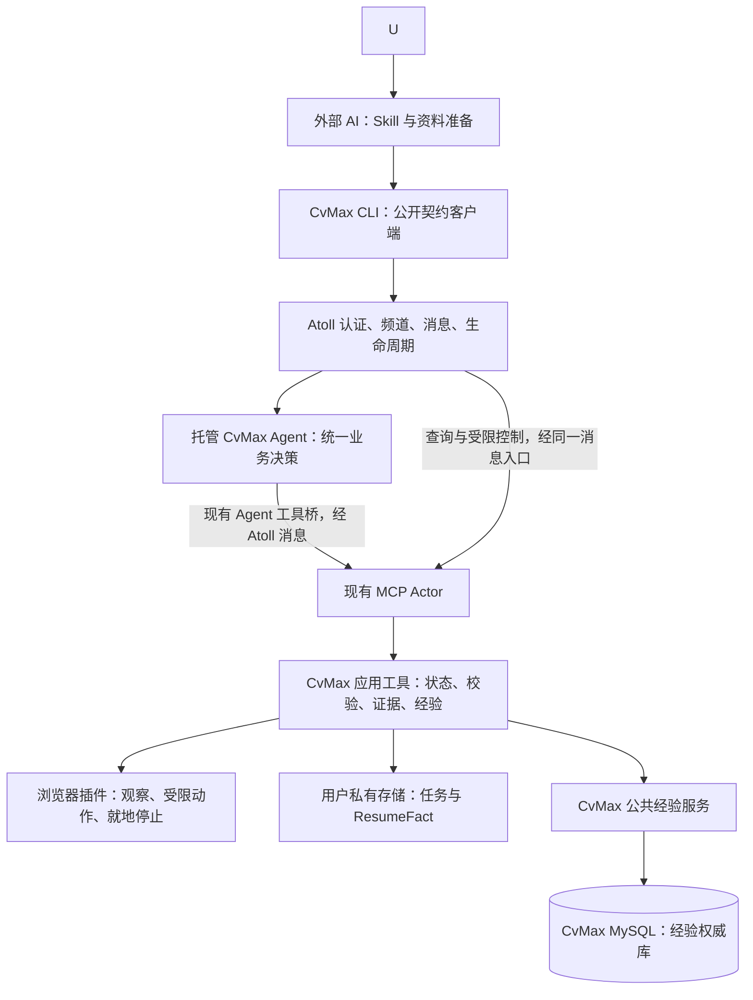

# CvMax 服务系统设计 v2.0

2026-09-06。当前实现设计。Atoll 基线 b447c91a；仅允许 tools/cvmax/ 应用扩展。产品范围见 [PRODUCT-DESIGN.md](PRODUCT-DESIGN.md)，系统契约依据见 [ARCHITECTURE-FIT.md](ARCHITECTURE-FIT.md)。

## 1. 最新决定与系统关系

CvMax 是构建在 Atoll 上的招聘填写服务。当前用户入口是已有 AI 桌面中的 Skill；系统 Web 仅保留未来接入口。后续入口仍须共用现有服务、任务、权限边界和经验。浏览器插件、CLI、Skill 都是服务组件。

本次改变应用职责，不要求改变 Atoll 核心。内部业务 Agent 负责页面理解、计划、异常决策与经验候选；外部 AI 负责接待用户、按授权准备资料、委托和展示。外部宿主可以是 Codex、Claude 或其他具备相应接入能力的工具，不宣称所有产品已支持同一种 Skill/命令机制。

入口与场景是独立维度：当前外部 AI 与未来 Web 是入口；当前页面、单链接、多链接是业务场景；串行是执行策略；二期推荐是未来的选岗来源。

## 2. 组件与职责

图中连线是职责方案，不代表自建消息总线。所有 actor 间调用沿现有系统机制；MCP stdio 工具与插件之间只承载获准动作及回执。

| 组件 | 拥有的职责 | 不拥有的职责 |
|---|---|---|
| Web（未来） | 复用现有身份与频道，展示状态并接入对话 | 当前实现范围、第二套任务状态、页面规划器 |
| 外部 Skill | 宿主用法、资料准备、结构化委托、渐进引导 | 逐字段执行循环、权威状态、独立学习库 |
| CLI | 服务连接、命令封装、JSON 回执、读取与控制 | 模型推理、常驻调度器、直接向插件启动业务 |
| 内部 Agent | 整体业务决策、字段映射、选择下一步、提出经验候选 | 在模型上下文中独占任务真相、修改权限与核心 |
| MCP 应用工具 | 请求去重、任务状态、条件写、固定动作校验、结果持久化、公共经验查询与匿名反馈 | 通用 Actor 生命周期、账号系统、第二套 Agent 调度 |
| 插件 | 目标绑定、DOM 观察和动作、执行后证据、服务状态的只读进度投影、就地停止闸门 | 业务自行启动、推理、独立进度状态机与用户资料管理 |

业务 Agent 用现有 codex/claude 类的声明与配置承载，不新增内置 cvmax Go 类。首轮验证只选一个已配置的内部引擎；外部入口产品与内部引擎可以不同。

## 3. 公共业务契约与内部动作分离

下列是已实现的应用命令，不是 Atoll 内置 API：

| 对外命令 | 语义 | 设计映射 |
|---|---|---|
| service connect/doctor | 显式选择现有身份、服务频道和浏览器；核查契约版本 | 现有认证、成员/状态查询；不自动升级核心 |
| resume save/list/get | 将一份获准本地简历保存为独立 ResumeFact，列出或读取其公开摘要 | 原文件进入应用私有目录；结构化投影不与其他简历合并，公共结果不返回事实原值 |
| task submit | Client 先通过 `request_save` 冻结当前页或链接清单、`resumeId + revision`/一次性资料与 no-final-submit 边界，再只委托 request ID | 内部 Agent 通过 `request_get` 读取不含事实值的公开范围，解析当前 tab 或逐个打开链接；`create` 从暂存请求冻结资料，不要求模型重传 |
| task status/report | 最近权威事实、完整结果与待办 | CLI 通过 Atoll 调应用查询；未来入口必须调用同一查询 |
| task answer | 回答指定 questionId/revision，保留适用范围 | 工具先原子保存答案；需要决策时由现有消息入口交给 Agent |
| task pause/stop | 持久阻止后续派发；停止不得依赖模型先完成当前轮 | 通过 Atoll 调领域控制工具；同一任务，非独立执行路径 |
| task resume | 显式恢复已暂停任务；先核验状态和网页 | Agent 处理恢复意图，工具校验版本与状态；停止后的旧 run 不可恢复 |
| task restart/skip | 新 run 或跳过当前岗位，保留范围与历史 | 领域事务；不能扩大原授权或悄悄绕回跳过项 |

对外不再提供“外部模型提出字段 plan 然后 execute”的正常产品流程。底层 observe/plan/apply/verify/experience 等由内部 Agent 经现有工具桥使用。验证夹具里的 start/propose/execute 不是 v2 公共命令设计。

固定版本的 CLI 可以知道服务接口和参数，无须每次动态学习所有底层工具。运行时 Actor 地址通过现有成员/声明解析，不把某次 incarnation 写死。错误的动态发现仍保留诊断；内部 Agent 原有工具使用指导和服务卡片对发现的依赖必须单独实测。

这里的职责分离不冒充新的权限隔离：同频道成员仍按 Atoll 原有规则拥有访问范围。仅不在 CLI 暴露内部命令，不代表系统已从安全层禁止成员调用它。若产品需要更强的角色限制，只能验证现有频道与服务边界是否支持，不在 MCP 参数里自报身份来伪造权限。

## 4. 接受任务与恢复的一致性

Task 是用户的一次委托；单岗委托也有 taskId，多岗 Task 含多个 Application。每个 Application 有 Run，动作有 Operation；模型轮次和 taskId 不是一回事。

请求带 clientRequestId，去重范围是服务实例与认证用户；同 key 不同内容返回冲突。未来增加入口时必须找回同一 taskId，不另造一份任务。相同 URL 只能作为候选重复线索，不能跨不同用户、资料、岗位或申请会话盲合并。

必须区分三种回执：Atoll 接受消息、业务任务已持久记录、页面效果已核验。只有第二种才能向用户说“任务已建立”；只有第三种才能说某字段已填好。模型文本里的“开始了”不等于任一种机器证据。

创建/回答持久化与 Agent 唤醒是不同事实。先保存成功而后续通知失败时，显示 queued/needs_attention 并保留命令 ID；通过原有系统重试/唤醒，或用户下一次显式继续进行归并，不创建常驻 CLI 重投循环。若现有契约无法在要求的预算内保证继续，A2 不通过，不能假装后台会继续。

业务工具是领域状态唯一写者；Agent 的计划必须经 schema、事实来源、expectedRevision、runEpoch、documentEpoch 和动作预算校验。单申请只允许一个活跃执行租约；必要的应用操作期限不是第二套 Actor 调度。

## 5. 入口一致性与人工交接

当前 Skill/Client 使用既有 Atoll principal 并具有目标频道资格；只看到 taskId 不授予访问权。未来入口必须满足同一规则。入口 origin 只用于体验与记录，不是授权依据。节点的一般 root/Agent 凭证不能静默复用。

Question 保存 questionId、taskId、revision、原因、当前动作、回答范围、状态。所有入口读取同一问题：一处回答成功，其他入口显示已解决。同版本重复同答案去重；不同答案条件冲突后重新读取，不以后来的屏幕覆盖已执行事实。

以用户最后操作的入口为主要反馈偏好；未来入口仍同步同一状态。这是应用通知偏好，不是系统权限。不能保证第三方桌面后台通知。用户回来先查询最新记录，避免再次问已回答问题。

同时停止和回答时，以服务事务实际顺序归并；stop 永久设置旧 run 停止闸门，之后的回答和迟到 Agent 计划均不能让其复活。只读状态刷新不触发继续。

## 6. 本地资料、未来 Web 与部署边界

一期是本地优先服务：Atoll 运行设备、获准资料与配对浏览器的位置明确。入口可有多个，不等于一期已支持云端执行或跨设备文件任意访问。

外部 AI 可以按用户授权抽取本地简历，并把原文件和带 provenance 的结构化投影保存为一个 ResumeFact。结构化投影是该简历的派生视图，不是跨简历用户档案；内部 Agent 复用可靠抽取结果，不要求每次重新解析，外部模型推测不能升为事实。

Client 先把获准文件暂存为有期限引用，`resume_save` 校验后复制到应用私有的简历版本路径；保存引用不可跨出该目录，不能由调用方伪造为永久引用。任务创建只接收准确的 `resumeId + revision`，服务内部冻结该版本的文件引用和结构化投影。本次岗位答案另存于任务快照，不回写简历。未来 Web 文件交付必须验证既有文件数据面和权限。

文件字节走现有文件数据面（跨设备时必须使用既有 /files ticket），消息仅带受限引用、摘要和必要内容；验证 MIME、大小、hash、作用域与可达性。一期简历库只在本机应用私有存储中存在，不等于商业资料中心或跨设备同步服务。

未来 Web 先复用现有频道对话，不新建导航、仪表盘和核心 UI 路由。若必须改既有 Web 核心，停止该入口实施，不能私自把独立网页称为“系统自带 Web”。

## 7. 状态、停止和执行结束

Task 状态：queued、running、waiting_native_parse、waiting_user、paused、needs_reconcile、needs_attention、finished、cancelled。Application 单独有 ready_for_review、partial、failed、cancelled 等结果；Task finished 只说明本轮自动处理结束，不代表全部填写完成。

运行阶段：观察 → 原生解析能力选择 → 原生解析后校验/自主填写兜底 → 网页核验。`waiting_native_parse` 表示网站解析已触发但尚未观察到可验证结果；30 秒内仅重新观察，不重放上传。无效后转自主填写，不向用户制造额外操作。每个阶段记录最近时间和责任人。只有登录、验证码、身份冲突或已证明为必填且必须由用户补充的字段可以进入 waiting_user；选填、未标必填和最终法律同意不会进入等待。等待用户持久化后结束当前 Agent 工作段，不保持无限长请求；继续通过系统现有消息/唤醒重入并读取状态。

招聘页内的进度卡不是新的状态源。岗位页由插件打开并完成加载后，先显示无任务写入能力的准备状态；任务建立后，应用服务在既有短租约、精确 tab/URL/run 绑定的命令中附带有界进度投影，或发送无页面写入能力的 `progress` 命令。投影包含 task revision、阶段、字段标签、页面大区块、临时目标引用、operation index/total、已核验动作和下一步负责人；插件用高亮框与连接线指向当前大区块。临时引用只在当前文档内解析，不包含事实值，也不按时间估算完成百分比。投影失败不改变权威任务结果。

暂停/停止必须先关闭应用派发闸门，再协调 Agent 中断和插件阻断。agent.interrupt、外部 CLI 退出、关闭网页都不等价于业务停止。插件立即停止可先在本地拒绝新动作，补报经正常工具链；它没有自主恢复权限。

未来 Web 若只有自然语言停止且 Agent 忙时不能及时处理，该入口验收失败。当前 Client 控制命令直接抵达领域闸门，插件提供页面内紧急停止。

节点/工具/浏览器断开后，不自动重放未知操作。新进程读取已发送或等待核验的动作时进入 needs_reconcile；已验证或确定未派发的动作安全排队接续。显式停止不解除。只读核对最多 30 秒后结束检查并报告未知。登录恢复必须重验账号可观察信息、岗位和文档；等待登录可继续，paused/cancelled 不能被登录解除。

## 8. 公共经验网络与业务边界

公共经验的权威数据存于 CvMax 应用自有的远程 MySQL，不能写入 Atoll 核心数据库，也不能以某个用户本机 JSON 作为全网事实源。用户侧应用服务只保留任务、ResumeFact、待上报反馈和已签名发布包缓存。内部 Agent 生成候选，工具在本地回读后形成去事实值的验证回执；公共服务聚合不同安装实例的证据并完成候选 → canary → released → suspended/rolled_back。单次成功不称学会；未经公共发布的本地候选不能直接成为其他用户的快速路径。

MySQL 物理边界固定为独立 `cvmax` 数据库。`page_families` 保存页面家族，`schema_versions` 保存值无关结构版本，`experience_releases` 保存候选与已发布配方，`field_strategies` 保存字段级动作策略，`experience_feedback` 保存去重后的匿名核验回执。运行时使用独立 `cvmax_app` 账号，仅拥有该库的 SELECT、INSERT、UPDATE、DELETE；root 只用于显式迁移和授权。个人简历、字段实际值、附件、页面截图、完整 DOM、账号身份和岗位查询参数不得进入公共库。

公共经验服务只发布建议配方，不成为第二个任务决策者。Hosted Agent 仍处理冷启动、结构漂移和异常；本地 MCP Service 仍绑定当前用户事实，并执行权限、已有值、敏感字段、预算、停止和页面回读门禁。公共服务不可直接调用插件。离线时只能使用仍在有效期内且签名有效的 released 缓存；反馈可排队，不能用未发布本地候选代替公共发布。

当前实现用 `origin + 归一化路由 + 表单阶段` 识别页面家族，将岗位数字 ID、UUID、长动态路径段和查询参数从路由模板中剔除。页面版本由值无关的字段结构集合确定；框架运行时生成 ID 只作为辅助锚点，不决定结构版本。一个页面家族可以同时保存多个表单版本。

经验以字段为最小升级和隔离单位。只有最终页面快照仍能独立证明的动作才计为一次成功；`ready_for_review` 与 `partial` 使用相同规则，因此人工同意或缺项不会丢弃其他字段的有效经验。公共升级必须依据多个独立安装实例、成功率、近期性和结构一致性，阈值由服务端发布策略决定，不能再以同一私有服务内两个 run 直接升级。事实值、页面当前值、附件字节、用户标识和用户自由文本反馈均不进入经验；自由文本反馈只归一化成有限失败原因。

`observe` 对精确版本返回确定性的无值 `suggestedActions`，对兼容版本仅返回仍能唯一绑定的稳定字段，同时列出新增、缺失和失配结构。内部 Agent决定是否采用这些建议，`apply` 再验证 strategyId、事实来源、字段当前值、敏感/人工边界、预算、租约和文档版本。写入后仍须重新观察；执行回执本身不会强化经验。

已知页面由内部 Agent 优先调用 `run_experience`。服务在一次工具调用内认领任务、观察页面、按既定策略尝试网站原生解析、应用 exact 经验、重新观察并按完成性终止。该命令复用普通 `apply` 和 `finish` 门禁；cold、compatible、结构漂移、现有值冲突、动作上限或必填缺项都会返回 `path: adaptive`，由同一 Agent 接续，不在服务中增加第二个决策者。

对用户提供的岗位详情链接，`open` 可从同 origin 的唯一 reusable 申请表路由模板中解析动态岗位 ID，并直接绑定申请表；没有唯一候选时保持原链接，不猜测。公共任务状态只投影事实数量和进度计数，事实原值由 Hosted Agent 在后续回合确需映射时通过内部 `task_context` 取得，避免状态查询和用户报告重复暴露资料。

页面否定已接受动作或可确认的控件/语义失败只隔离相关字段策略；未知传输故障继续走 reconcile，不自动污染经验。结构变化中的未匹配策略不会执行；成功处理新版本后形成并行版本，而不是覆盖旧版本。页面家族分类整体错误时才暂停整页经验。

自进化仅组合已发布固定动作，包括受约束的 `native_parse`；不生成任意 JS 执行、不改变 Skill 强制边界、测试或核心。网站原生解析经验仅保存能力信号、页面指纹、效果和后续纠错策略，不保存用户值。每字段最多 2 策略、每页 3 次重规划、每申请 10 分钟活跃预算为待评测默认草案，等待用户不计入；换入口/重启不重置。

性能热路径不得让 Hosted Agent 在每个确定性动作之间重复推理。精确命中可复用页面版本时，Agent 选择一次已验证配方，MCP 应用工具在相同事实、revision、run/document epoch、预算和停止闸门下连续执行并统一回读；任何不满足前置条件的字段退出配方并交还 Agent。新页面仍由 Agent 生成受限计划，但应批量提交动作，只在页面反馈改变计划时重新推理。ResumeFact 引用使任务消息只携带简历身份和本次答案，事实原值在服务冻结后按需提供给内部 Agent。

只填写与核验，不最终提交；明确真正的必填缺项、未知效果及最终手动步骤。选填和未标必填的空白不阻塞任务，也不要求用户补齐。浏览器填值可能触发站点自动保存。资料中心、推荐数据、商业账户与支付仍属二期，既有 Atoll 身份和本地执行服务不是二期商业后台。

## 9. 新版验收与原发现问题的定位

| 阶段 | 必须证明 | 失败时停在哪里 |
|---|---|---|
| A1 服务内一字段 | Skill/Client 发委托 → 托管 Agent → 正常工具桥 → MCP → 插件填值核验；回执有真实 Agent 身份 | 不能改核心或让外部模型代做来称通过 |
| A2 正式入口与控制 | 当前页、单链接和多链接进入同一契约；回答去重、停止优先、委托持久化与唤醒失败恢复 | 不另建任务系统或让 Client 直接驱动浏览器 |
| A3 权限与故障 | 非成员拒绝；文件路径；断线、工具/节点退出、未知结果、重复、旧回执与预算 | 不假设本地连接安全、超时未执行或 Agent 中断即浏览器停 |
| B 完整申请 | 正式入口覆盖必填、重复经历、附件、登录、缺项和批次 | 不以单字段或原型替代 |
| C 经验闭环 | 新页面候选、验证、再次复用、变体漂移、纠正和回退 | 不把对话记忆当持久经验 |
| D 发布与复验 | 真实受授权流程族、安装与宿主支持表、真实链路验收 | 发布在独立工程完成，未来 Web 单独验收 |

早期验证只证明“人类身份直接调工具与观察页面”。当前正式链路已经证明 Client 委托、托管 Agent、MCP Service 和插件协作可用；`actor.describe` 发布缺陷修复后，内部 Agent 可通过标准工具定义调用服务。

实施状态更新：用户授权的 MCP 发布缺陷修复已经完成。CvMax 在应用层完成单链接真实申请、原生简历解析、纠错补填、经验命中、进度投影、渐进提问和停止验收；后续业务开发仍只在 tools/cvmax/，不能把该授权泛化为其他核心变更许可。

应用现有持久任务、问题、答案、停止闸门、Client/CLI 和唯一 CvMax Skill。已有能力通过普通开发测试维护，不再使用 A1/A2/A3 的独立验证流程作为产品结构。
