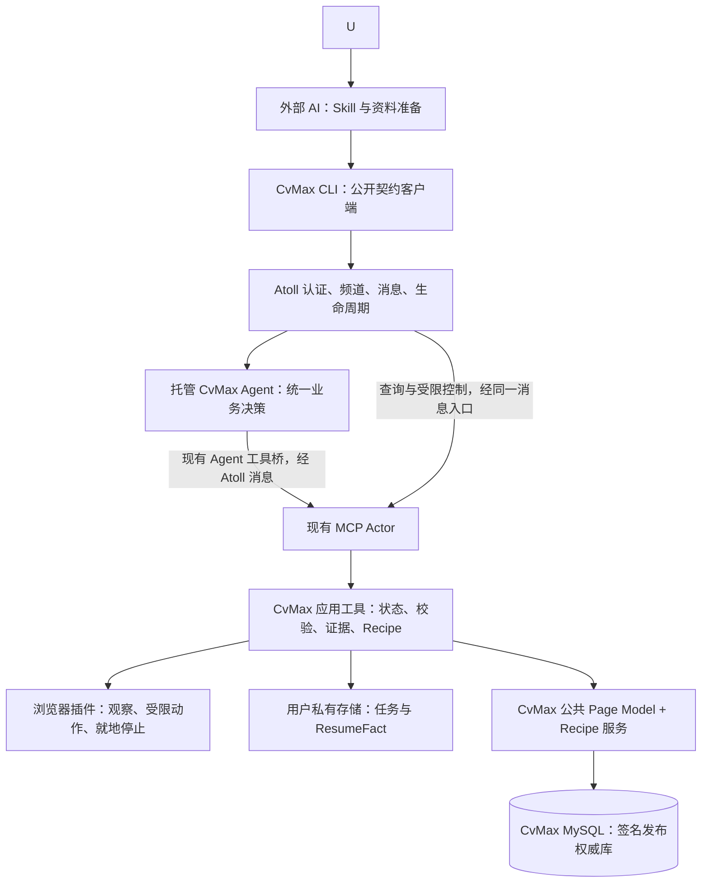

> 2026-09-13：Recipe 执行正在收敛为 Service 持久化的严格有序状态机。最新产品承诺、学习/验证/Recipe 设计以 [LEARNING-DESIGN.md](LEARNING-DESIGN.md) 为准，实施进度以 [TODO.md](TODO.md) 为准；已经失效的旧执行路径不保留兼容实现。

# CvMax 服务系统设计 v2.0

2026-09-06。当前实现设计。Atoll 基线 b447c91a；仅允许 tools/cvmax/ 应用扩展。产品范围见 [PRODUCT-DESIGN.md](PRODUCT-DESIGN.md)，系统契约依据见 [ARCHITECTURE-FIT.md](ARCHITECTURE-FIT.md)。

## 1. 最新决定与系统关系

CvMax 是构建在 Atoll 上的招聘填写服务。当前用户入口是已有 AI 桌面中的 Skill；系统 Web 仅保留未来接入口。后续入口仍须共用现有服务、任务、权限边界和经验。浏览器插件、CLI、Skill 都是服务组件。

本次改变应用职责，不要求改变 Atoll 核心。内部业务 Agent 负责页面理解、计划、异常决策与经验候选；外部 AI 负责接待用户、按授权准备资料、委托和展示。外部宿主可以是 Codex、Claude 或其他具备相应接入能力的工具，不宣称所有产品已支持同一种 Skill/命令机制。

入口与场景是独立维度：当前外部 AI 与未来 Web 是产品入口；当前页面、单链接、多链接是委托方式；页面级入口只有岗位详情页和最终填写页；串行是执行策略；二期推荐是未来的选岗来源。

## 2. 组件与职责

图中连线是职责方案，不代表自建消息总线。所有 actor 间调用沿现有系统机制；MCP stdio 工具与插件之间只承载获准动作及回执。

| 组件 | 拥有的职责 | 不拥有的职责 |
|---|---|---|
| Web（未来） | 复用现有身份与频道，展示状态并接入对话 | 当前实现范围、第二套任务状态、页面规划器 |
| 外部 Skill | 宿主用法、资料准备、结构化委托、渐进引导 | 逐字段执行循环、权威状态、独立 Recipe 库 |
| CLI | 服务连接、命令封装、JSON 回执、读取与控制 | 模型推理、常驻调度器、直接向插件启动业务 |
| 内部 Agent | 未知 Recipe 节点分析、字段义映射与异常决策 | 在已知节点重复推理、在模型上下文中独占任务真相、修改权限与核心 |
| MCP 应用工具 | 请求去重、任务状态、条件写、固定动作校验、结果持久化、Recipe 选择与匿名反馈 | 通用 Actor 生命周期、账号系统、第二套 Agent 调度 |
| 插件 | 目标绑定、DOM 观察和动作、执行后证据、服务状态的只读进度投影、就地停止闸门 | 业务自行启动、推理、独立进度状态机与用户资料管理 |

业务 Agent 用现有 codex/claude 类的声明与配置承载，不新增内置 cvmax Go 类。首轮验证只选一个已配置的内部引擎；外部入口产品与内部引擎可以不同。

## 3. 公共业务契约与内部动作分离

下列是已实现的应用命令，不是 Atoll 内置 API：

| 对外命令 | 语义 | 设计映射 |
|---|---|---|
| service connect/doctor | 显式选择现有身份、服务频道和浏览器；核查契约版本 | 现有认证、成员/状态查询；不自动升级核心 |
| resume save/list/get | 将一份获准本地简历保存为独立 ResumeFact，列出或读取其公开摘要 | 原文件进入应用私有目录；结构化投影不与其他简历合并，公共结果不返回事实原值 |
| task submit | Client 先通过 `request_save` 冻结当前页或链接清单、`resumeId + revision`/一次性资料与 no-final-submit 边界，再创建任务 | 链接清单直接成为逐 Application 的任务授权；当前页只绑定一次当前 tab；执行到某个 Application 时才打开它，`create` 从暂存请求冻结资料，不要求模型重传 |
| task status/report | 最近权威事实、完整结果与待办 | CLI 通过 Atoll 调应用查询；未来入口必须调用同一查询 |
| task answer | 回答指定 questionId/revision，保留适用范围 | 工具先原子保存答案；需要决策时由现有消息入口交给 Agent |
| task pause/stop | 持久阻止后续派发；停止不得依赖模型先完成当前轮 | 通过 Atoll 调领域控制工具；同一任务，非独立执行路径 |
| task resume | 显式恢复已暂停任务；先核验状态和网页 | Agent 处理恢复意图，工具校验版本与状态；停止后的旧 run 不可恢复 |
| task restart/skip | 新 run 或跳过当前岗位，保留范围与历史 | 领域事务；不能扩大原授权或悄悄绕回跳过项 |

对外不提供“外部模型提出字段 plan 然后 execute”的正常产品流程。底层 `run_recipe` 与缺口状态下的 observe/apply/verify/recipe_feedback 由内部 Agent 经现有工具桥使用。验证夹具里的 start/propose/execute 不是 v2 公共命令设计。

固定版本的 CLI 可以知道服务接口和参数，无须每次动态学习所有底层工具。运行时 Actor 地址通过现有成员/声明解析，不把某次 incarnation 写死。错误的动态发现仍保留诊断；内部 Agent 原有工具使用指导和服务卡片对发现的依赖必须单独实测。

Client、Service、Extension 和 Recipe Bundle 分别声明 `current` 与 `minimum` 协议版本。Client 在诊断时检查 Service；插件配对时与 Browser Bridge 双向检查；Recipe 使用签名包的 format version。版本区间没有交集时，在任何页面动作之前拒绝连接。公共 Recipe 内容更新不改变程序协议；签名密钥轮换通过上一把可信密钥签署转换声明，客户端在线扩展信任链，不要求插件升级。

这里的职责分离不冒充新的权限隔离：同频道成员仍按 Atoll 原有规则拥有访问范围。仅不在 CLI 暴露内部命令，不代表系统已从安全层禁止成员调用它。若产品需要更强的角色限制，只能验证现有频道与服务边界是否支持，不在 MCP 参数里自报身份来伪造权限。

## 4. 接受任务与恢复的一致性

Task 是用户的一次委托；单岗委托也有 taskId，多岗 Task 含多个 Application。每个 Application 有 Run，动作有 Operation；模型轮次和 taskId 不是一回事。

请求带 clientRequestId，去重范围是服务实例与认证用户；同 key 不同内容返回冲突。未来增加入口时必须找回同一 taskId，不另造一份任务。相同 URL 只能作为候选重复线索，不能跨不同用户、资料、岗位或申请会话盲合并。

必须区分三种回执：Atoll 接受消息、业务任务已持久记录、页面效果已核验。只有第二种才能向用户说“任务已建立”；只有第三种才能说某字段已填好。模型文本里的“开始了”不等于任一种机器证据。

创建/回答持久化与 Agent 唤醒是不同事实。先保存成功而后续通知失败时，显示 queued/needs_attention 并保留命令 ID；通过原有系统重试/唤醒，或用户下一次显式继续进行归并，不创建常驻 CLI 重投循环。若现有契约无法在要求的预算内保证继续，A2 不通过，不能假装后台会继续。

业务工具是领域状态唯一写者；Agent 的计划必须经 schema、事实来源、expectedRevision、runEpoch、documentEpoch 和动作预算校验。单申请只允许一个活跃执行租约；必要的应用操作期限不是第二套 Actor 调度。

## 5. 入口一致性与人工交接

当前 Skill/Client 使用既有 Atoll principal 并具有目标频道资格；只看到 taskId 不授予访问权。未来入口必须满足同一规则。入口 origin 只用于体验与记录，不是授权依据。节点的一般 root/Agent 凭证不能静默复用。

招聘站点范围不属于安装配置。用户提供的单个链接、冻结链接清单或明确选择的当前页，是对应 Application 的授权来源；Service 将其持久化为绑定 taskId、runId、tabId、当前精确 URL 和短租约的页面能力。插件不维护公司名单，新增网站和公共经验不触发插件更新或 Service 重启。页面转换必须由当前任务的已验证入口动作产生并重新绑定，不能把一次任务的页面能力复用于其他任务。

Question 保存 questionId、taskId、revision、原因、当前动作、回答范围、状态。所有入口读取同一问题：一处回答成功，其他入口显示已解决。同版本重复同答案去重；不同答案条件冲突后重新读取，不以后来的屏幕覆盖已执行事实。

以用户最后操作的入口为主要反馈偏好；未来入口仍同步同一状态。这是应用通知偏好，不是系统权限。不能保证第三方桌面后台通知。用户回来先查询最新记录，避免再次问已回答问题。

同时停止和回答时，以服务事务实际顺序归并；stop 永久设置旧 run 停止闸门，之后的回答和迟到 Agent 计划均不能让其复活。只读状态刷新不触发继续。

## 6. 本地资料、未来 Web 与部署边界

一期是本地优先服务：Atoll 运行设备、获准资料与配对浏览器的位置明确。入口可有多个，不等于一期已支持云端执行或跨设备文件任意访问。

页面接入不是独立状态机。`detail`、申请入口动作及 `form_ready` 都是同一张 Recipe 图里的页面 state 和 transition。详情 state 只允许执行唯一、可见、非最终提交的申请入口动作。执行后插件回传新 Tab、同 Tab 导航或同文档表单出现的证据；Service 只绑定新的 Application Surface 并继续 settlement 当前 Recipe transition，不创建 `acquiring_form` 等平行业务状态。同一个已验证入口动作可能因登录态、站点简历状态不同而到达登录、验证码、简历前置页或申请表；这些是同一动作的合法结果分支，不是 Recipe 异常。回放时只要稳定观察到其中一种明确业务表面，就立即确认当前 transition、记录新分支并继续下一条已知边，不等待旧分支的页面哈希超时，也不重新点击入口。未知弹窗或未知页面不属于该结果集合。

若申请入口后出现登录、验证码或站点简历前置要求，状态进入已有 `waiting_user`；若页面没有可验证变化，进入有限重试或 `needs_attention`，不能把点击回执当成已经进入申请表。页面级入口不接受岗位列表、搜索结果、公司主页和未知导航页，不负责选岗，也不执行最终提交。

外部 AI 可以按用户授权抽取本地简历，并把原文件和带 provenance 的结构化投影保存为一个 ResumeFact。结构化投影是该简历的派生视图；稳定但通常不写进简历的资料保存在独立 UserProfile revision。创建任务时合并指定 profile revision、本次唯一 ResumeVersion 和 TaskAnswers，随后冻结为 ApplicationFactSnapshot；简历之间不互相补值，内部 Agent 不要求每次重新解析，外部模型推测不能升为事实。

Client 先把获准文件暂存为有期限引用，`resume_save` 校验后复制到应用私有的简历版本路径；保存引用不可跨出该目录，不能由调用方伪造为永久引用。任务创建只接收准确的 `resumeId + revision`，服务内部冻结该版本的文件引用和结构化投影。本次岗位答案另存于任务快照，不回写简历。未来 Web 文件交付必须验证既有文件数据面和权限。

文件字节走现有文件数据面（跨设备时必须使用既有 /files ticket），消息仅带受限引用、摘要和必要内容；验证 MIME、大小、hash、作用域与可达性。一期简历库只在本机应用私有存储中存在，不等于商业资料中心或跨设备同步服务。

未来 Web 先复用现有频道对话，不新建导航、仪表盘和核心 UI 路由。若必须改既有 Web 核心，停止该入口实施，不能私自把独立网页称为“系统自带 Web”。

一期不实现商业账号，但接口从现在起区分四类标识：`userId` 是未来 CvMax 云账号，`installationId` 是本机安装实例，`atollPrincipal` 是 Atoll 认证主体，`taskId` 是一次委托。当前任务权限仍由 Atoll principal、频道资格和任务能力共同决定；installation ID 只用于公共经验的独立证据与凭据撤销，不能作为用户身份。

未来云端商业控制面独立承载账号、权益、计费、岗位目录、推荐和运营后台，使用 CvMax 自有数据库与 API。它可以向入口返回用户有权查看的岗位数据，也可以校验一次委托是否具备权益，但不保存本机 ResumeFact、不直接调用插件、不调度内部 Agent，也不写 Atoll 核心数据库。用户确认岗位后，链接清单仍通过现有 `task submit` 冻结为 Applications，由本机执行面逐个打开和填写。

## 7. 状态、停止和执行结束

Task 状态：queued、running、waiting_native_parse、waiting_user、paused、needs_reconcile、needs_attention、finished、cancelled。Application 单独有 ready_for_review、partial、failed、cancelled 等结果；Task finished 只说明本轮自动处理结束，不代表全部填写完成。

Recipe 是唯一业务状态机，但不再维护全页“标准页面”。每个步骤由粗粒度业务里程碑、当前动作目标的局部精确守卫、动作模板和局部后置条件组成。Page Model 仅解释页面结构与 ResumeFact 的对应关系，不参与 Recipe 步骤身份。Service 只持久化正在执行的 Recipe transition cursor：`locked → dispatching → settling → matched`，不再保存一套平行的 Application workflow 状态图。Task 状态只负责调度生命周期；Operation 是追加式动作与回执记录；二者都不能决定业务后继状态。

选择了简历时，Service 以不可绕过的产品 guard 约束 Recipe：发现原生能力、上传及必要结构导航完成前不允许普通字段写入；当前页面暂时看不到上传控件不等于能力不存在。上传前字段基线和附件签名保存在上传 Operation 的动作证据中，之后的覆盖确认是下一条 Recipe transition，解析观察以 `attemptOperationId` 追加关联到原上传 Operation。若原生解析能力在附件上传后才出现，Service 必须复用上传回执执行唯一的 `explicit_confirm` 解析动作；该动作由 `run_recipe` 根据真实页面上的唯一安全候选直接建立学习假设并推进，不等待 Hosted Agent 排队，动作结果仍经过同一验证、候选编译和独立回放发布链。解析变化必须由两个独立页面观察稳定确认；弱网、刷新或重启继续 settlement 当前 Recipe transition，已有浏览器回执的动作不重放。解析成功只证明相应责任项，Service 仍按 ApplicationPlan 处理项目、校园等剩余事实；冷页面以有界观察确认无解析或解析不足，再进入自主填写。

业务顺序由 Recipe transition 表达：观察 → 原生解析能力选择 → 原生解析后校验/自主填写兜底 → 网页核验。`waiting_native_parse` 只是 Task 调度生命周期的暂停投影，表示当前 Recipe transition 已触发网站解析但尚未观察到可验证结果；它没有业务后继选择权。30 秒内仅重新观察，不重放上传。无效后转自主填写，不向用户制造额外操作。登录、验证码/CAPTCHA、实际遮挡并阻止进入简历流程的法律同意弹窗，以及确实阻挡进入简历区域的页面必填前置项可以进入 waiting_user；招聘账号与简历姓名、电话和邮箱不做一致性比较。最终提交阶段的法律同意直接进入最终人工清单。等待用户持久化后结束当前 Agent 工作段，不保持无限长请求；继续通过系统现有消息/唤醒重入并读取状态。

招聘页内的进度卡不是新的状态源。岗位页由插件打开并完成加载后，先显示无任务写入能力的准备状态；任务建立后，应用服务在既有短租约、精确 tab/URL/run 绑定的命令中附带有界进度投影，或发送无页面写入能力的 `progress` 命令。投影包含 task revision、阶段、字段标签、页面大区块、临时目标引用、operation index/total、已核验动作、下一步负责人，以及由 Service 从权威状态生成的完整用户业务流程步骤。流程步骤只标记已完成、当前、待处理、已跳过或需用户处理，插件只读渲染，不自行推断业务后继状态。插件用高亮框与连接线指向当前大区块。临时引用只在当前文档内解析，不包含事实值，也不按时间估算完成百分比。投影失败不改变权威任务结果。

暂停/停止必须先关闭应用派发闸门，再协调 Agent 中断和插件阻断。agent.interrupt、外部 CLI 退出、关闭网页都不等价于业务停止。插件立即停止可先在本地拒绝新动作，补报经正常工具链；它没有自主恢复权限。

未来 Web 若只有自然语言停止且 Agent 忙时不能及时处理，该入口验收失败。当前 Client 控制命令直接抵达领域闸门，插件提供页面内紧急停止。

节点/工具/浏览器断开后，不自动重放未知操作。新进程读取已发送或等待核验的动作时进入 needs_reconcile；已验证或确定未派发的动作安全排队接续。显式停止不解除。只读核对最多 30 秒后结束检查并报告未知。登录恢复必须重验账号可观察信息、岗位和文档；等待登录可继续，paused/cancelled 不能被登录解除。

## 8. Recipe 网络与自进化边界

线上执行只认一个控制模型：**招聘系统 Recipe 有序程序**。Recipe 以招聘系统身份为根，局部守卫、已核验动作及局部后置条件构成步骤；入口点击、登录后恢复、简历上传/解析、弹窗确认、分区切换和字段填写都属于同一程序。运行时不再拼接 entry/form/recovery/interaction 四类经验，不建立全页字段标准模型，也不按字段集合计算相似度。

浏览器动作锚点必须来自观察端已经筛选出的可操作交互集合。观察端和 MAIN world 执行端共用同一候选筛选、身份规范化和 ordinal 解析实现；固定导航、遮罩或重渲染产生的同名 DOM 节点不能进入其中一端而不进入另一端。执行前仍重新核验命中与遮挡，失败时不降级为按 DOM 顺序猜测。

每条边只有一个 Service 所有的持久化 transition cursor：`locked → dispatching → settling → matched`。cursor 与 operation 在动作派发前原子创建；回执后先即时检查目标状态，未命中才进行有界重读。Chrome 的动作回执不是业务后置条件。活动 cursor 独占本 Application 的页面解释权，普通观察、加载恢复和 Agent 路由不得并行改判；同一任务的观察也必须串行写入。刷新、新文档和 SPA 重渲染只使 DOM 引用失效，不自动使业务 transition 失败。

业务里程碑只由 `origin + systemMarkers + 归一化路由 + surface + pageState + formStage + 必要能力位` 生成；它不包含字段语义、字段值、任意网站问题或完整控件集合。每一步再用动作目标的结构锚点、唯一性和“事实仍需处理”作局部守卫。动态岗位 ID、查询参数和运行时 DOM ref 不参与身份；当前步骤只有三种决定：唯一命中并执行、责任边界终止、缺少/冲突步骤并交给 Agent。跨域同一 ATS 只有在插件能够提供经过验证的 `systemMarkers` 后才共享；没有可靠标记时退化为公司 origin 级 Recipe。

插件只提供稳定原语：观察原始结构锚点、填写、选择、上传、通用激活、窗口/同页转换、进度、停止。它不含公司名单、站点选择器、区块别名和 Recipe。签名 release 同时携带语义映射与 Recipe：语义映射帮助动作绑定 ResumeFact，Recipe 用自己的局部结构守卫执行，两者单向组合而不共享流程身份。因此新增或修正招聘站点不要求升级插件。Service 每次进入页面里程碑都会按 system key 从 Registry 拉取签名 release，并与已有程序做追加合并；缓存只用于短期离线执行。

冷启动时，Hosted Agent 观察页面并通过同一 `apply`/`navigate` 门禁执行受限动作。对于未知区块，它只能选择控件的第一个原始结构锚点和一个标准区块；Service 要求该锚点唯一，并在动作后置结构通过后才把映射加入 Page Model。每次动作在新快照中通过后，Service **立即**写入 `from state → action template → to state`，不等待整个任务结束。发布包只保存公共结构锚点、标准区块、字段/控件锚点、factId、动作种类和后置条件，不保存事实值、附件、完整 DOM、截图、用户身份或岗位查询参数。任务结束时只把当前状态标为 Recipe 终态。下一次同系统、同状态可直接程序执行。

本机首次核验的转换可以立即用于本机复测；跨用户复用仍由公共 Registry 按 candidate → canary → released 聚合不同 installation 的证据。Registry 的权威库是独立 `cvmax` MySQL：`recipe_systems` 保存系统身份，`recipe_releases` 保存完整签名图，`recipe_feedback` 保存匿名转换反馈；另有 installation、签名密钥、审计和匿名性能表。旧页面家族、结构版本、字段策略和四类经验表已删除。

发布时合并完整 Recipe 程序，不覆盖旧步骤。若同一局部守卫出现两条不同可复用动作，发布门禁将候选挂起，避免后加入经验破坏旧流程。执行失败只挂起对应 transition；未知传输结果进入 reconcile，不污染 Recipe。软件协议和 Recipe format 独立版本化，Recipe 更新热加载，只有新增浏览器原语或修复通用执行器才需要插件升级。

终止条件按不可缩减的 ApplicationPlan 和 ObligationLedger 判断，不按页面填满，也不按关键字段判断。每个冻结事实与附件必须得到回读核验或证据化例外；项目、校园等可变长度区块必须遍历并按记录数动态添加。网站专属问题、投递偏好、法律最终步骤和最终提交交给用户。所有正常结束路径共用同一个完成闸门；Recipe 终态不能旁路它。已知 Recipe 热路径不启动 Hosted Agent，只有缺转换、绑定不唯一、登录/验证码、事实冲突、动作核验失败或预算到限才退出到自适应路径。

持续的空白加载遮罩属于传输恢复，不进入 Recipe。Service 只有在申请页连续两次出现同一无文字、无字段、无业务控件的阻断层，且持续至少 10 秒时，才允许自动刷新当前精确绑定的 Tab 一次并重新观察。带文字的弹窗、登录、验证码、法律同意和已出现表单字段的页面都不进入该恢复分支。

## 9. 新版验收与原发现问题的定位

| 阶段 | 必须证明 | 失败时停在哪里 |
|---|---|---|
| A1 服务内一字段 | Skill/Client 发委托 → 托管 Agent → 正常工具桥 → MCP → 插件填值核验；回执有真实 Agent 身份 | 不能改核心或让外部模型代做来称通过 |
| A2 正式入口与控制 | 当前页、单链接和多链接进入同一契约；回答去重、停止优先、委托持久化与唤醒失败恢复 | 不另建任务系统或让 Client 直接驱动浏览器 |
| A3 权限与故障 | 非成员拒绝；文件路径；断线、工具/节点退出、未知结果、重复、旧回执与预算 | 不假设本地连接安全、超时未执行或 Agent 中断即浏览器停 |
| B 完整申请 | 正式入口覆盖必填、重复经历、附件、登录、缺项和批次 | 不以单字段或原型替代 |
| C 经验闭环 | 新页面候选、验证、再次复用、变体漂移、纠正和回退 | 不把对话记忆当持久经验 |
| D 发布与复验 | 真实受授权流程族、安装与宿主支持表、真实链路验收 | 发布在独立工程完成，未来 Web 单独验收 |

早期验证只证明“人类身份直接调工具与观察页面”。当前正式链路已经证明 Client 委托、托管 Agent、MCP Service 和插件协作可用；`actor.describe` 发布缺陷修复后，内部 Agent 可通过标准工具定义调用服务。

实施状态更新：用户授权的 MCP 发布缺陷修复已经完成。CvMax 在应用层完成单链接真实申请、原生简历解析、纠错补填、经验命中、进度投影、渐进提问和停止验收；后续业务开发仍只在 tools/cvmax/，不能把该授权泛化为其他核心变更许可。

应用现有持久任务、问题、答案、停止闸门、Client/CLI 和唯一 CvMax Skill。已有能力通过普通开发测试维护，不再使用 A1/A2/A3 的独立验证流程作为产品结构。
