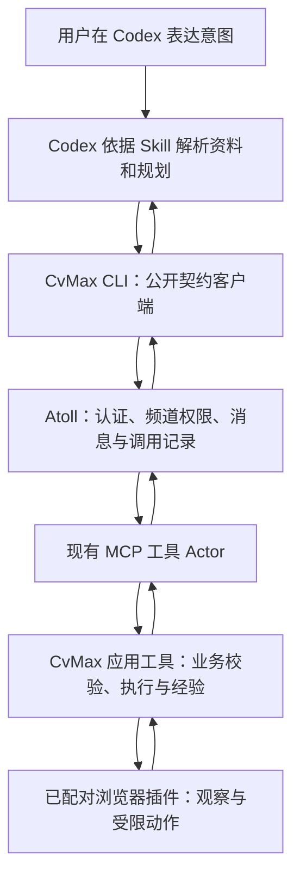

# CvMax × Atoll：架构适配与停止契约 v1.0

状态：历史设计约束；切片 A 曾在本地实验中受阻，不是生产链路通过声明。本应用不能为满足业务反向要求系统改变。

## 1. 架构验收优先于功能验收

通过验收必须同时证明“业务完整”和“系统原生扩展”。文件都在 tools/cvmax/ 只是必要条件，不能据此证明架构合规。独立服务若复制核心职能或绕过权限/账本，同样不接受。

优先级：用户明确的核心禁改与系统原有不变量 → 现有公开扩展契约 → 应用功能与体验 → 实现便利性。功能做不到时应报告能力缺口，不用临时后门让演示通过。

## 2. 已有依据与应用映射

| 系统现有设计/代码 | CvMax 应沿用 | 不允许的替代 |
|---|---|---|
| README：频道是边界，membership 决定权限，发送者由系统记录 | 明确实际 principal、频道和工具成员，按现有权限发起请求 | 自填 sender、借 root token 冒充 Agent、应用账号绕过成员检查 |
| README：`/ws` 写、`/obs` 观察、`/files` 文件数据面 | CLI 是公开契约客户端；业务工具调用走消息链 | REST 业务写后门、直接写核心 SQLite |
| MCP actor 动态发现外部工具并映射消息类型 | 运行时声明现有 mcp 类，接入 CvMax 应用工具 | 新增内置 cvmax Go class 或修改注册器 |
| MCP Config 支持 stdio/http、command/args/cwd 和超时 | 优先验证现有 stdio 子进程方式承载本地工具 | 自建守护进程管理器代替 Atoll 生命周期 |
| Codex worker 已有工具表装配与动态调用桥 | 托管 Agent 使用已有工具桥，保留真实身份 | 让托管 Agent 通过人类凭证的 CLI 改换调用身份 |
| 核心保有生命周期、调度和账本 | 应用只处理填写领域状态、执行预算与经验 | 第二套通用 Actor 注册、通用消息总线、核心调度器/身份库 |
| archtest 依赖方向固定 | 外部 Node/TypeScript 包和运行时配置，零核心修改 | 放宽测试或 import 内部 Go 包；在 tools 下新增 Go 核心依赖来绕过边界 |

证据路径：

- [README 基本原则](../../README.md#features)、[公开调用接口](../../README.md#from-a-script)、[设计原则](../../README.md#design-notes)。
- [MCP 工具 Actor](../../drivers/tools/mcp/actor.go)：discover/listTools、消息映射、调用及超时处理。
- [MCP 配置](../../drivers/tools/mcp/config.go)：现有严格配置 schema 和 stdio/http。
- [Codex worker](../../drivers/agents/provider/codex/worker.go)：工具装配、dynamicTools、item/tool/call。
- [分层检查](../../archtest/import_direction_test.go)：封闭依赖图；脚本只说公开契约语言。

README 中某些能力状态表落后于上述代码，代码存在也不等于本应用已跑通。README 链接的 docs/architecture/ 在当前检出中不存在，不能把未读到的架构文档当证据。[plugin-bridge](../plugin-bridge/cli.js) 是跨机器透明转发工具，既不是 CvMax CLI，也不是招聘业务执行器，不借用它增加旁路。

## 3. 一期标准接入链路

CLI 不直接向插件发送开始/继续/答案等业务写指令。它把输入转换为 Atoll 请求并读取结果；原始简历在用户本机由 Codex 读取，不要求先上传到新后台。

工具内部与插件的连接是已授权操作的数据/执行通道：页面观察、动作、附件及回执。它不接受任意来源启动业务，也不能修改 run 授权范围。插件可在本地立即阻断新动作，这是执行器停止闸门；断线时应先阻断、保留事实，恢复后通过工具正常链路补报。该闸门不具备恢复或启动权限。

协议转换、结构化 CLI 封装、浏览器控件适配属于应用自然扩展；权限旁路、独立自动调度、核心私有状态访问不属于。

## 4. Codex 身份与 Agent 归属

必须区别两个上下文，不能在文档或代码中悄悄互换：

1. **用户自己的 Codex 窗口作为外部客户端（一期交互入口）。** Codex 按 Skill 调 CLI；CLI 使用用户明确配置的既有 Atoll 身份加入目标频道，账本上的发送者就是该身份，不能宣称当前 Codex 自动成为 Atoll 托管 Agent。禁止默认读取 root token 冒充任意用户。
2. **Atoll 托管的 Codex Agent。** 它已经是系统成员，调用应走已有工具桥；不能调用带人类凭证的 CLI 将身份变成人类。若未来要在此上下文保留完全相同的 CLI，必须先找到并验证现有身份保持接口；找不到就停止该 CLI 方案，不能新增核心接口或降级为 root。

一期默认不再启动第二个 Atoll Agent 重复同一轮推理。外部 Codex 提出资料与计划，Atoll 工具负责受控执行；系统是否足以支撑这种客户端入口，必须由切片 A 的身份和权限实测证明。

Atoll 托管 Agent 的主动唤醒与外部 Codex 窗口不是同一能力。不能因为系统有 timer 就宣称能唤醒任意外部对话。外部窗口结束后，保留等待/待恢复记录；用户回来时重新查询。自动唤醒需另行验证现有公开契约，不能自建定时进程直接控制浏览器作为替代。

## 5. 生命周期、状态与账本归属

优先验证现有 MCP stdio 进程接入：Atoll 管理工具 Actor，现有 MCP 适配器管理应用子进程连接。工具内部可拥有受此进程生命周期约束的有限操作、浏览器连接和本地事务，但不能创建独立于系统停止状态的长期执行循环。

每次工具调用短时返回；待用户或模型决策时返回结构化阻塞，不在 MCP 请求里反向等待 Codex 调自己。长操作返回 operationId，后续通过 Atoll 调状态工具；stdio 路径不能让一个长请求阻塞停止请求。

应用进程/节点退出、连接授权失效时，插件的执行租约到期并阻断新动作。既有原子动作的效果可能未知；重启只能先观察核对，不自动重放。该行为必须实测，不能把“子进程被关闭”当作浏览器已停止的充分证据。

| 数据 | 权威归属 |
|---|---|
| principal、频道成员、Actor、已投递请求与系统响应、调度事实 | Atoll 原有机制和账本；本应用只经公开接口使用 |
| 申请字段、资料快照引用、网页动作证据、业务 run 状态、领域预算、经验版本 | 应用私有持久存储；通过已接入工具访问 |
| 浏览器当前 DOM、上传接受情况、网站提交结果 | 外部网站可观察证据；本地状态只能记录最近确认结果 |
| 用户对话和临时推理 | Codex 宿主；不承担业务状态持久化的权威职责 |

Atoll 账本中的结果是某次调用的业务状态收据，包含 runId/revision/来源和时间，不是可独立编辑的另一份申请状态。应用 DB 不复制频道权限和系统调度；CLI/插件只显示状态，不维护另一个可写的任务真相。

工具返回的业务事实与系统事件必须能通过 request/operation/run ID 关联。不得在应用后台偷偷执行，然后事后写一条总结来冒充执行经过系统授权。

## 6. CLI 与工具契约草案

命令名是应用方案，尚未实现，不是 Atoll 已有内置命令。

| CLI | 应用工具用途 |
|---|---|
| `cvmax doctor --json` | 公开接口连通性、身份/频道/工具可达性、插件配对状态；不修补核心 |
| `cvmax start --tab <id> --input <file> --json` | 创建/附着授权申请；产生 runId，固定资料快照和目标 |
| `cvmax inspect <run-id> --json` | 观察、缺项、未知映射和可执行候选上下文 |
| `cvmax plan <run-id> --input <file> --json` | 提交 Codex 的结构化候选，静态校验后产生 planId |
| `cvmax execute <run-id> --plan <id> --json` | 按版本和授权执行有限批次并核验 |
| `cvmax answer <run-id> --input <file> --json` | 本次或明确指定批次的答案；更新受影响计划 |
| `cvmax status/report <run-id> --json` | 最近确认状态/完整结果；应用状态查询也通过工具消息 |
| `cvmax pause/resume/stop <run-id> --json` | 显式控制；resume 先重验；stop 后重新开始必须新 run |
| `cvmax experience ... --json` | 检索、候选提交、验证、禁用等业务经验工具 |

共享返回字段：schemaVersion、runId、operationId（如有）、revision、state、lastConfirmedAt、freshness、blockingReasons、nextActionOwner、nextAction、terminal、retryable。业务等待不冒充系统调用失败；transport timeout 不证明工具未执行。

stdout 为结构化结果，stderr 为诊断；不在 stdout 混入进度文本。资料通过受限文件/标准输入传入，不把整份简历和凭证拼进命令行。重复写请求带 clientRequestId，条件写带 expectedRevision，状态查询只读。

文件引用不等于任意路径可读：一期工具与简历所在设备明确绑定，只接受本应用授权的资料/附件引用。远端部署和跨设备传输不作为一期默认能力；涉及 Atoll 文件数据面时沿用既有 `/files` ticket 契约。实际文件路径、大小和权限在 A 中验证。

## 7. 信任边界

现有 MCP tools/call 的参数不能被当作可信 principal 来源。首版计划每个用户/私有频道独立实例和存储，部署时固定配置；Atoll 负责入口成员权限，应用不能通过用户传入 principal/channel 切换身份。

必须证明只有规定的系统工具路径可调用应用业务端点。stdio 优先；如改用 HTTP，必须证明端点认证、实例隔离和来源绑定，不能以“localhost”代替权限证明。浏览器配对也要限定具体扩展、来源、run/tab/epoch，不把页面文本当执行指令。

这不是重新设计系统通用权限：应用只验证招聘操作的授权对象、资料来源和动作前后条件，不制造新的通用角色与账户模型。

填入页面可能触发网站自动保存；“未最终提交”不等于“资料没有发送”。应用清理仅覆盖自己的快照/证据/经验；不承诺删除 Atoll 账本或模型历史。需要全链路擦除而系统契约不支持时按停止条件处理。

## 8. 切片 A 的证据清单

当时已测试挂载、页面观察及部分身份边界；动态能力发现失败，完整切片未通过。以下保留当时的验收要求；该阶段性验证流程现已退役。

| 验证项 | 必须取得的证据 |
|---|---|
| 运行时挂载 | 通过现有公开声明/成员机制出现工具及 schema，无核心注册改动 |
| 身份与权限 | 合法身份允许、无成员身份拒绝，账本发送者正确；无借用 root |
| 一字段闭环 | CLI 请求 → 账本请求 → MCP → 插件填值 → 页面核验 → 关联收据 |
| 不存在旁路 | 禁用/拒绝正常系统入口后，CLI 不能切到插件或 HTTP 管理接口完成同一写操作 |
| 重复和回执丢失 | 同一请求不重复写；未知结果经观察归并，不凭超时重放 |
| 停止与生命周期 | 运行中停止、断开节点、工具退出、插件重连均不导致后续旧动作继续；在途结果如实记录 |
| 恢复 | 先读取权威状态和网页，用户暂停/停止不会因登录/刷新解除 |
| 数据面 | 资料引用、附件权限、消息大小、文件传递路径实际可用，未读写核心 SQLite |
| 推理交接 | 未知字段返回当前 Codex；Codex 提交候选后按原 run 继续，不递归调用另一个 Agent |
| 状态展示 | 用户能知道最近确认事实与下一步，外部对话退出后不假装还能被自动唤醒 |

架构闭环先于完整功能。证据注明命令、系统请求 ID、run/operation ID、浏览器结果、实际基线与失败原因，不以 mock/stub 通过替代真实系统契约证明。

## 9. 禁改路径与停止规则

唯一可修改路径：`tools/cvmax/`。不改根依赖、Makefile、go.mod/go.sum、已有 UI、protocol/runtime/lib/platform/registry/drivers/cmd/archtest 或其他应用；不写核心 DB 或迁移 Atoll home；不放宽测试。新应用配置通过现有管理接口声明，不等于修改核心源文件。

出现下列任一情况，停止依赖该能力的实现，保留已完成文档/证据；若影响核心闭环则暂停整个实施：

- 要改核心逻辑、设计、类型、路由、权限、调度或注册才能执行。
- 要访问未公开内部包/数据库，或伪造调用身份。
- 要另建不经过系统的开始/继续/自动执行路径才能满足体验。
- 现有契约无法保证停止、必要身份隔离或结果真实性，只能用口头约定替代。
- 应用职责需要复制系统通用生命周期/权限/消息机制才能运行。

阻塞报告固定包含：用户需求 → 对应系统原则 → 实际公开调用及最小复现 → 失败证据 → 涉及的核心边界 → 是否存在仍在原有设计内的应用调整及限制 → 停止的工作范围。

应用内 schema/控件/文案/领域状态实现问题可在授权范围内修复；不能把核心不适配包装成普通 bug 绕过去。缩减业务承诺必须明确报告，不能悄悄删掉经验积累、核心流程或 Atoll 依赖。提出未来核心演进建议也不等于获得本分支修改许可。
